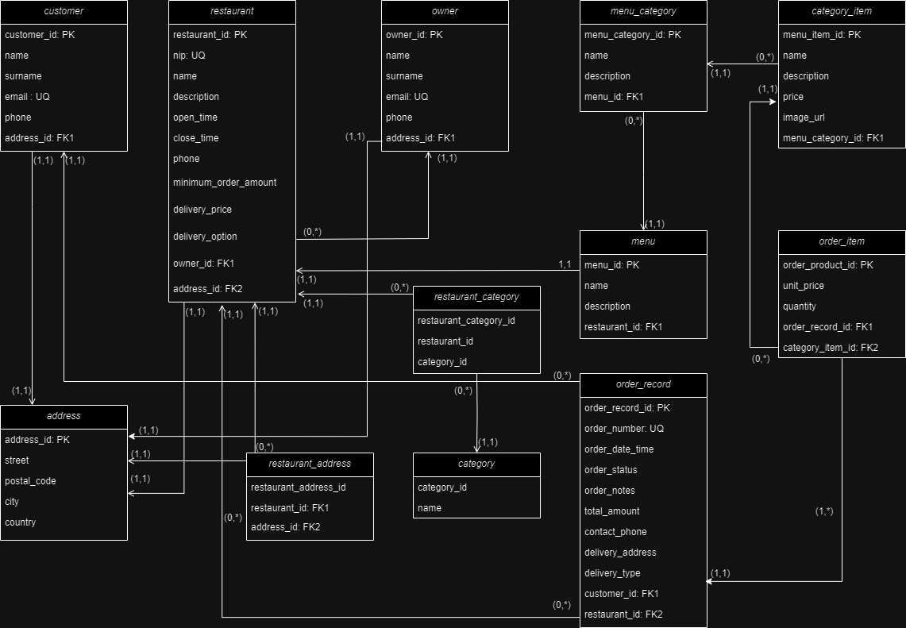

# FoodFlow

FoodFlow is a straightforward food ordering portal that enables restaurant owners to create accounts, establish their
restaurants, define menus, specify delivery locations, and manage orders.

Customers can also create accounts, search for restaurants,
view menus, place orders, and, under certain conditions,
cancel orders.

## ERD Diagram

## Features for restaurant owners

Account Creation: Restaurant owners can create accounts on the platform to offer their food delivery services.

Menu Management: Owners can define their menus by specifying food categories (appetizers, soups, main courses,
desserts) and adding items with descriptions and prices.

Image Upload: Owners can upload images for each menu item to assist customers in making choices.

Delivery Locations: Owners can provide a list of streets to which they deliver food.

Order List: Owners can view a list of orders received, categorized as pending and completed.

Order Completion: Owners can mark orders as completed (this is simplified in the application,
as typically delivery personnel would do this).

## Features for customers

Account Creation: Customers can create accounts on the platform.

Search for Restaurants: Customers can search for restaurants that offer food delivery based on the street they provide.

Pagination and Sorting: The list of restaurants can be paginated and sorted.

View Menus: Customers can select a restaurant and view its menu.

Place Orders: Customers can place orders by selecting desired items and quantities.

Order Confirmation: After placing an order, customers receive a confirmation with a unique order number.

Order Cancellation: Customers can cancel orders if it has been less than 5 minutes since they were placed.

## Getting started

To get started with this food ordering portal, follow these steps:

- Clone the repository to your local machine.
- Set up a PostgreSQL database and configure the application.yml to connect to it.
- Build and run the application.
- Access the portal through a web browser.

## Technologies used

- Java
- Spring Boot
- Hibernate
- PostgreSQL
- Thymeleaf (for frontend templates)
- RESTful API for communication
- Swagger for documenting REST APIs
- RestAssured for API testing

## Authors

- [@Author](https://www.github.com/MateuszMechula)
