# TEST APPLICATION -> https://food-flow-75e570332cc6.herokuapp.com/foodflow

## Demo Accounts

#### To explore FoodFlow's features, you can use the following demo accounts:

#### Owner Account:

username: owner <br>
password: test

#### Customer Account:

username: customer <br>
Password: test

# FoodFlow

FoodFlow is a straightforward food ordering portal that enables restaurant owners to create accounts, establish their
restaurants, define menus, specify delivery locations, and manage orders.

Customers can also create accounts, search for restaurants,
view menus, place orders, and, under certain conditions,
cancel orders.

## ERD Diagram

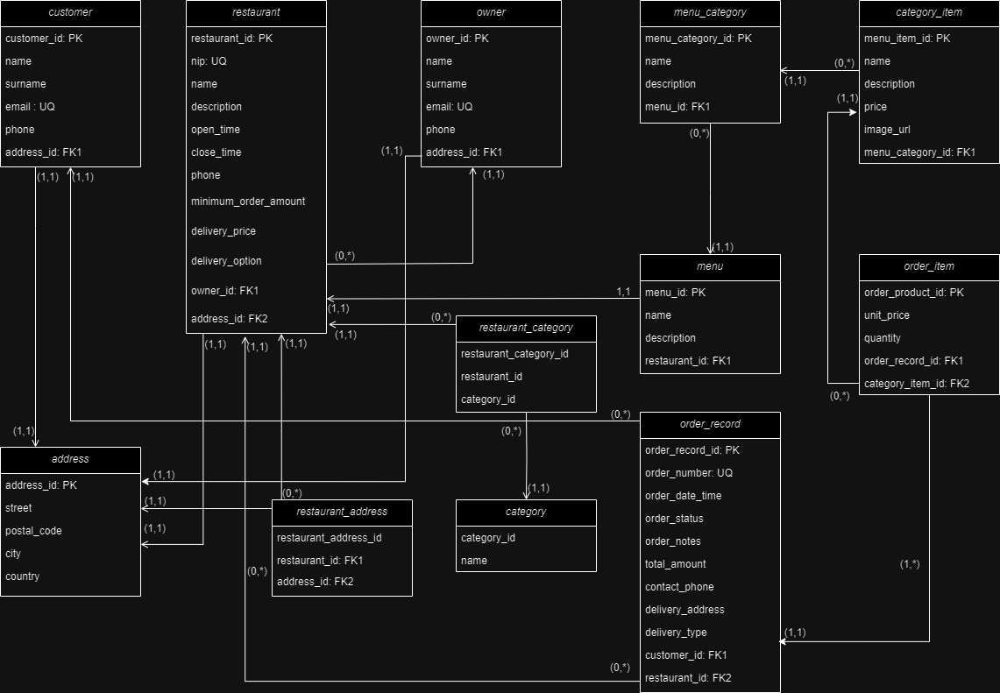

Account Creation: Restaurant owners and customers can create accounts on the platform.

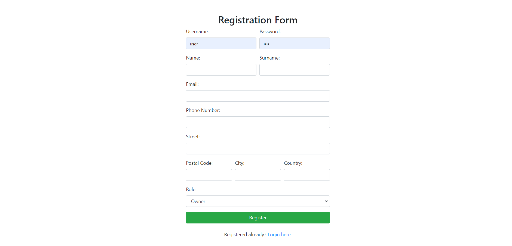

## Features for restaurant owners

Menu Management: Owners can define their menus by specifying food categories (appetizers, soups, main courses,
desserts) and adding items with descriptions and prices.

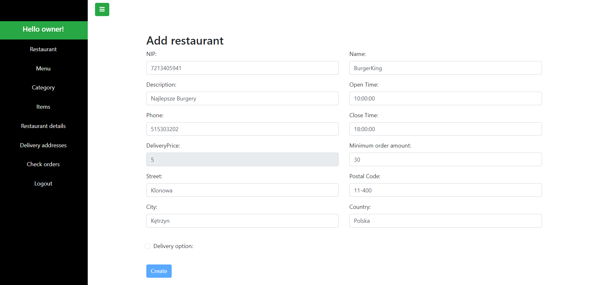
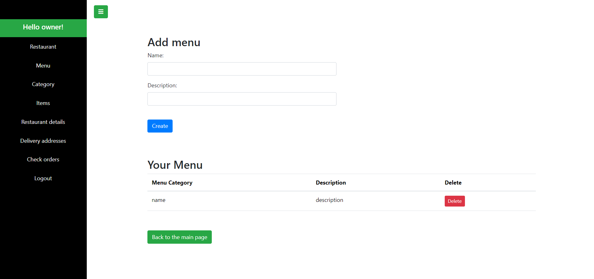
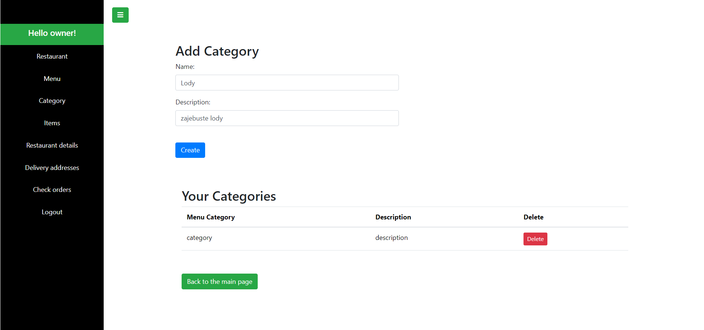
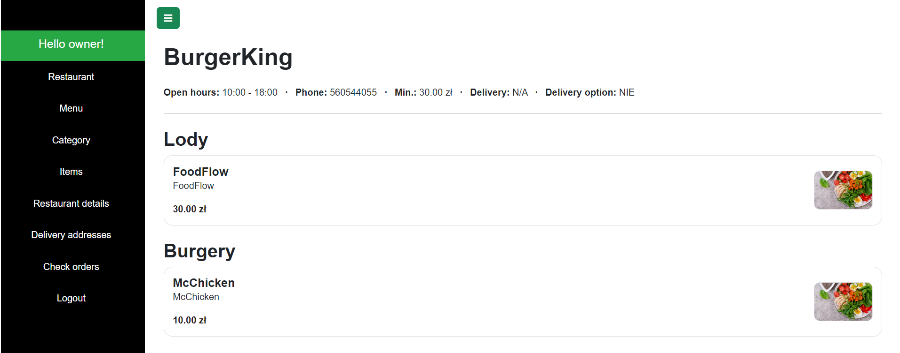

Image Upload: Owners can upload images for each menu item to assist customers in making choices.

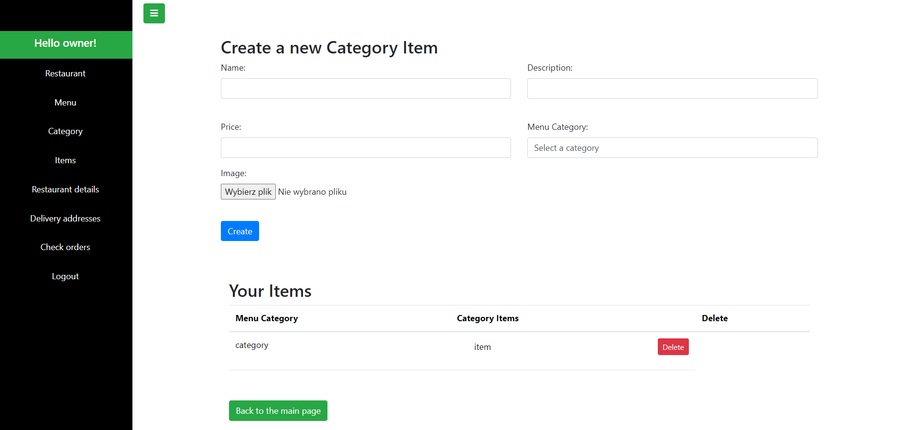

Delivery Locations: Owners can provide a list of streets to which they deliver food.

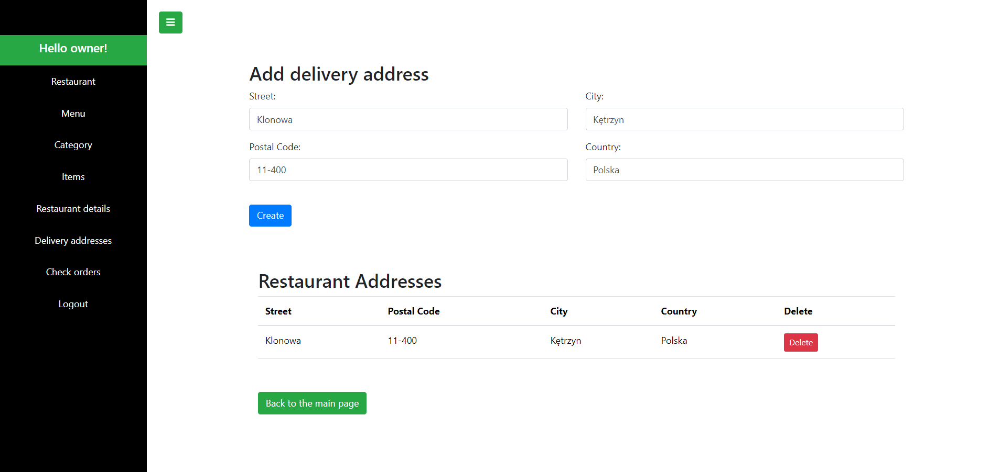

Order List: Owners can view a list of orders received, categorized as pending and completed.
Order Completion: Owners can mark orders as completed (this is simplified in the application,
as typically delivery personnel would do this).

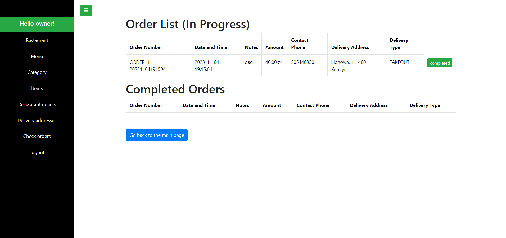

## Features for customers

Search for Restaurants: Customers can search for restaurants that offer food delivery based on the street they provide.

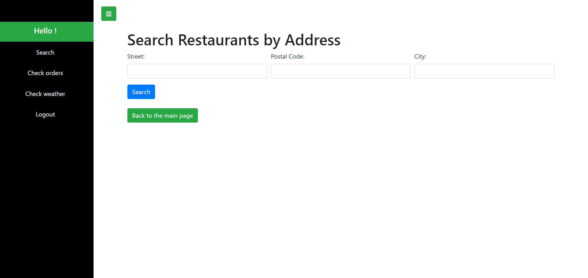

Pagination and Sorting: The list of restaurants can be paginated and sorted.

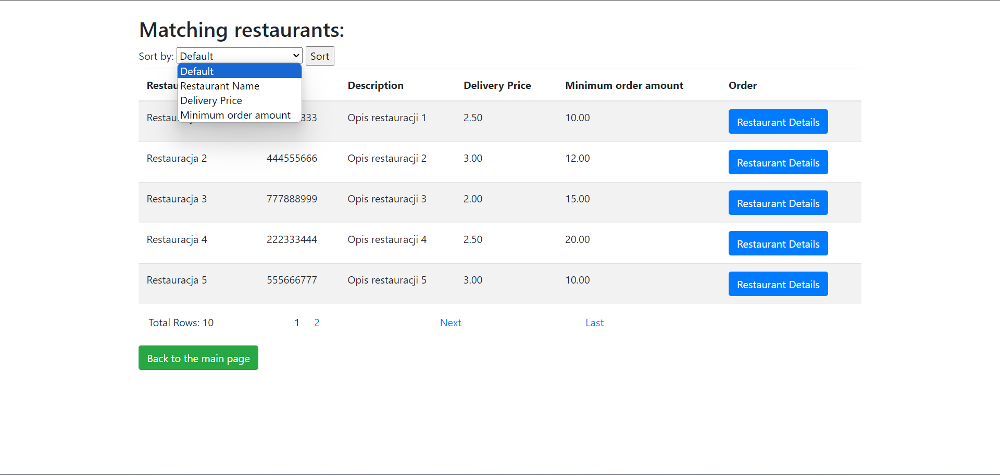

View Menus: Customers can select a restaurant and view its menu.

Place Orders: Customers can place orders by selecting desired items and quantities.

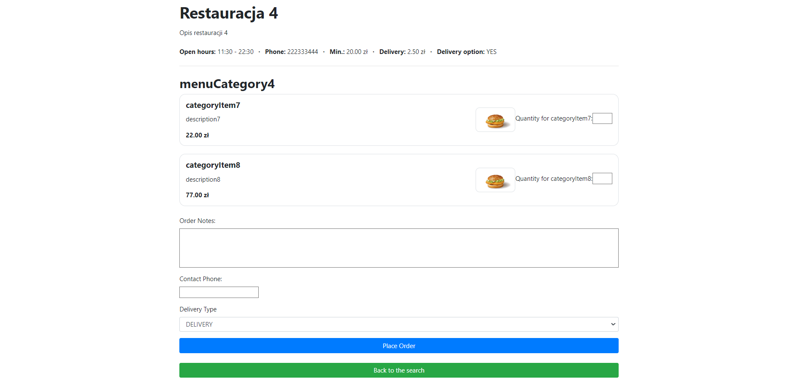

Order Confirmation: After placing an order, customers receive a confirmation with a unique order number.

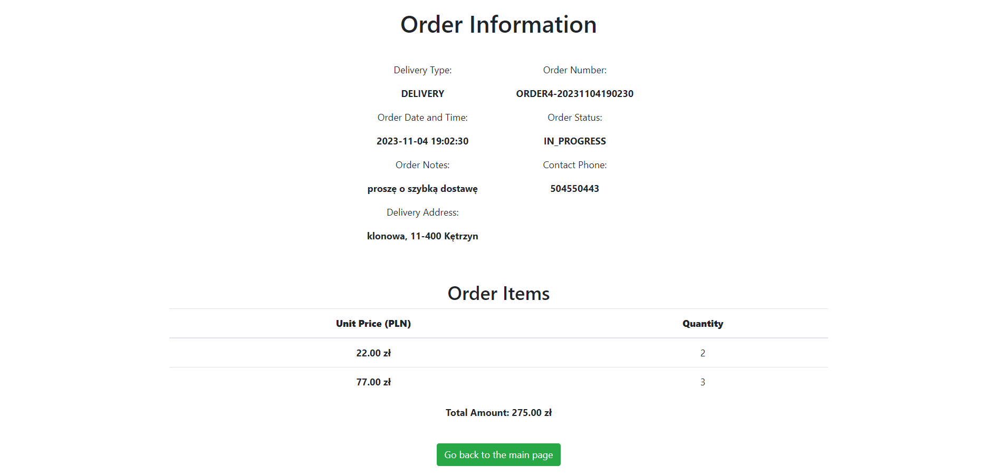

Order Cancellation: Customers can cancel orders if it has been less than 5 minutes since they were placed.

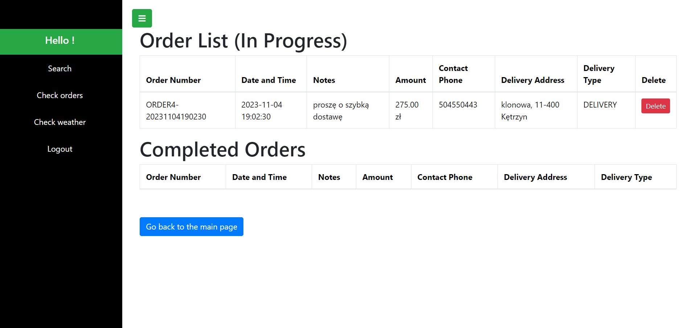

NEW FEATURE (29.10.2023) : CHECK WEATHER IN YOUR CITY!

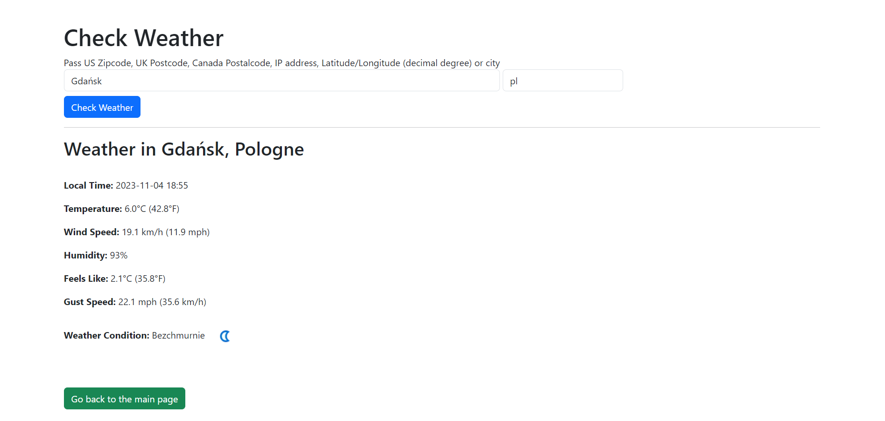

## Getting started

1. Clone project

  ``` bash      
   git clone https://github.com/mateuszmechula/foodflow.git
  ```

2. Open cloned directory

  ``` bash      
   cd foodflow
  ```

3. Build project

  ``` bash
  ./gradlew clean build
  ```

4. Go to docker directory

  ``` bash      
   cd docker
  ```

5. Run using docker-compose

  ``` bash
  docker-compose up -d
  ```

## Technologies used

### Backend

- Spring Boot
- Spring Web
- Spring Security
- Spring Data PostgreSQL
- Lombok
- Gradle
- Flyway
- Mapstruct
- OpenAPI Generator (WebClient)

### Backend Testing

- JUnit
- Mockito
- RestAssured
- Testcontainers
- Wiremock

### Database

- PostgreSQL

### Frontend

- Thymeleaf

### Other

- Docker
- Swagger

## Authors

- [@Author](https://www.github.com/MateuszMechula)
